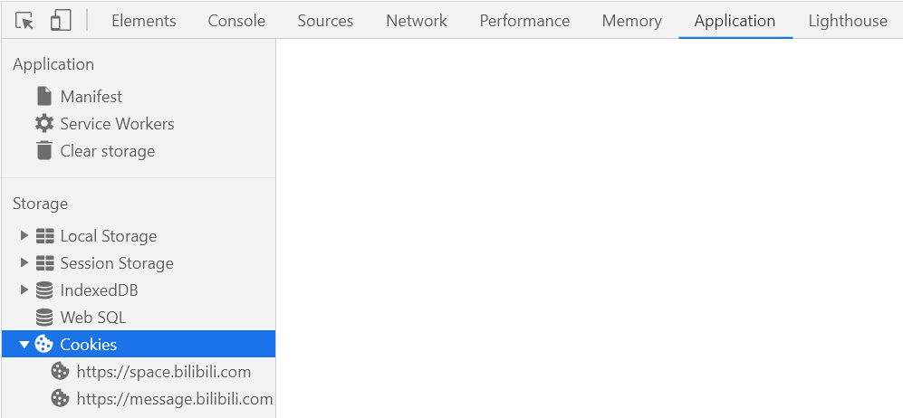

# AutoScript
  

## 动态抽奖  
通过Github Actions挂载Nodejs脚本  
> [Actions官方文档](https://docs.github.com/en/free-pro-team@latest/actions/reference/workflow-syntax-for-github-actions)

---

## 操作步骤

↓  

### Fork本仓库  
  

↓  

### 填入COOKIE  
对于chrome浏览器
1. `F12`打开控制台  
2. 进入Application找到Cookies栏中的SESSDATA将HttpOnly选项**取消**勾选  
    (此步骤是为了方便后续采用JS获取Cookies)  
      
    取消httponly
      
3. 在Console中复制以下代码回车
    ```js
    {
        let bilicookie = '';
        document.cookie.split(/\s*;\s*/).forEach(item=>{
            const _item = item.split('=');
            if (['DedeUserID','bili_jct','SESSDATA'].indexOf(_item[0]) !== -1)
                bilicookie += `${_item[0]}=${_item[1]}; `;
        })
        copy(bilicookie); /* 自动复制到粘贴板 */
        console.log(bilicookie)
    }
    ```
4. 新建一个COOKIE将获取到的`DedeUserID=...;SESSDATA=...;bili_jct=...`填入  
      

也可以采用其他方式获取所需的Cookie
只需含有`DedeUserID=...;SESSDATA=...;bili_jct=...`三项即可  

↓  

### 微信推送中奖信息(可选)  
如果想使用Server酱提供的**微信推送**服务  
> [Server酱是什么?](http://sc.ftqq.com/3.version)  

可在`Repository secrets`中新建一个`SCKEY`并填入相应的值  
  

↓  

### 运行
随便改一下此`README.md`文件并提交  
  
  

进入Actions启用工作流

↓  

### 完成!
效果
  

### 更新
> [如何同步更新Github上Fork的项目](https://www.cnblogs.com/idyllcheung/p/13555934.html)

---

## 其他细节
支持最多5个账号  
|cookies   | value |
|   ----   |  ---- |
| `COOKIE` |  值   |
| `COOKIE2`|  值   |
| `COOKIE3`|  值   |
| `COOKIE4`|  值   |
| `COOKIE5`|  值   |

部分设置说明
- 定时运行(`UTC`时间)  
    ```yaml
    schedule:
      - cron: '0 */2 * * *'
    ```  
    [填写格式](https://crontab.guru/)  
- 模式选择  
    ```javascript
    /**
     * 默认设置
     */
    let config = {
        model: '11',/* both */
        chatmodel: '11',/* both */
    }
    ```  
    [具体含义](https://github.com/shanmite/LotteryAutoScript/issues/2)  

---

