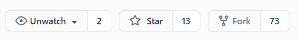
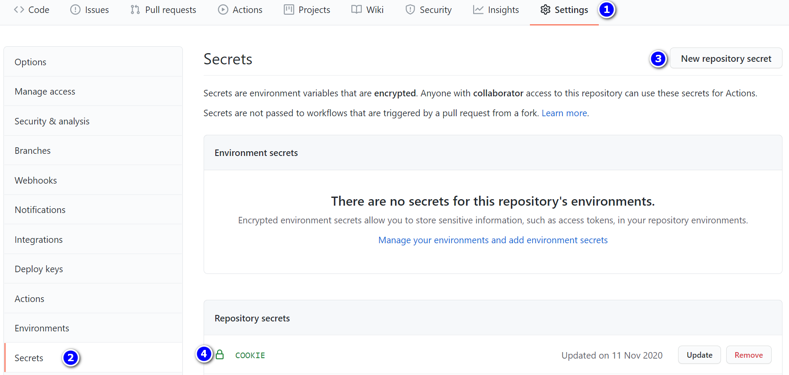

# AutoScript


  


  


  


  

<!-- TOC -->

- [AutoScript](#autoscript)
  - [动态抽奖](#动态抽奖)
  - [操作步骤](#操作步骤)
    - [Fork本仓库](#fork本仓库)
    - [填入COOKIE](#填入cookie)
    - [防重复转发](#防重复转发)
    - [检测中奖](#检测中奖)
      - [手动检查](#手动检查)
      - [中奖推送(可选)](#中奖推送可选)
    - [运行](#运行)
    - [完成!](#完成)
  - [清理动态](#清理动态)
  - [其他细节](#其他细节)
    - [更新](#更新)
    - [自动更新](#自动更新)
    - [本地运行](#本地运行)
      - [Windows](#windows)
      - [Linux](#linux)
    - [多账号支持](#多账号支持)
    - [如何关闭](#如何关闭)
    - [部分设置说明](#部分设置说明)
      - [定时运行(`UTC+0`)](#定时运行utc0)
      - [模式选择](#模式选择)
      - [自定义设置](#自定义设置)

<!-- /TOC -->


---

## 动态抽奖  

借助Github Actions定时运行Nodejs脚本  

  > [Actions官方文档](https://docs.github.com/en/free-pro-team@latest/actions/reference/workflow-syntax-for-github-actions)  

如果README图片加载失败可前往[此处](https://gitee.com/shanmite/LotteryAutoScript)查看  

已实现功能:  
  > 点赞 评论 转发 @好友 带话题 随机动态 检测开奖 清理

[油猴版本](https://greasyfork.org/zh-CN/scripts/412468)  

声明: 此脚本仅用于学习和测试，作者本人并不对其负责，请于运行测试完成后自行删除，请勿滥用！  

---

## 操作步骤  

右上角<kbd>★ Star</kbd>  

↓↓  

### Fork本仓库  



↓↓  

### 填入COOKIE  

进入[B站主页](https://www.bilibili.com/)获取Cookie用于登录  
Chrome浏览器:  

1. `F12`打开控制台  
2. 进入Application找到Cookies栏中的SESSDATA将HttpOnly选项**取消**勾选  

    (此步骤是为了方便后续采用JS获取Cookies)  


3. 在Console中复制以下代码回车  

    ```js
    /** 自动复制到粘贴板 */
    document
      .cookie
      .split(/\s*;\s*/)
      .map(it => it.split('='))
      .filter(it => ['DedeUserID','bili_jct', 'SESSDATA'].indexOf(it[0]) > -1)
      .map(it => it.join('='))
      .join('; ')
      .split()
      .forEach(it => copy(it) || console.log(it))
    ```

4. 进入你Fork的GitHub仓库  
  `Settings` => `Secrets` => 新建一个`Repository secrets`COOKIE将获取到的`DedeUserID=***;SESSDATA=***;bili_jct=***`填入  

> 此处页面可能会有所不同,不用在意  

  

  

也可以采用**其他方式获取**所需的Cookie  
只需含有 `DedeUserID=...;SESSDATA=...;bili_jct=...` 三项即可  
(分号分割, 不要换行, 顺序随意)  

↓↓  

### 防重复转发
~~此脚本将在B站专栏草稿中储存转发过的动态id以防止重复转发~~  
运行结束后会将转发过的动态上传至构件(`Artifacts`)  
为了能够从构件中下载文件，需要access token权限  

1. 点我创建 [`授权令牌`](https://github.com/settings/tokens/new)

2. 如图，勾选前两项即可：


3. 将 令牌 复制（注意，先复制，一旦关闭网页就不能查看了），再新建`Secrets`，键名 填入 `PAT`

注: 填好此处后脚本将会与主仓库自动同步, 可手动关闭

↓↓  

### 检测中奖  
每两个小时检测一次  
> 检测未读信息
> 已读未读信息

- 通过`@`信息判断  
- 通过私信判断  

关键词有限 可能会有**漏掉**的或**误报**

#### 手动检查  
手动触发`Automatic check`工作流后可在日志中查看

#### 中奖推送(可选)  
> 例如在 `Repository secrets` 中新建一个 `SCKEY` 并填入对应的值  
>   

以下是详细说明

|       Name        |                                        归属                                        | 属性   | 说明                                                                                                                                                                                                                        |
| :---------------: | :--------------------------------------------------------------------------------: | ------ | --------------------------------------------------------------------------------------------------------------------------------------------------------------------------------------------------------------------------- |
|      `SCKEY`      |                         微信server酱推送(将在2021/4月下线)                         | 非必须 | server酱的微信通知[官方文档](http://sc.ftqq.com/3.version)                                                                                                                                                                  |
|     `SENDKEY`     |                             微信server酱(Turbo版)推送                              | 非必须 | [获取SENDKEY](https://sct.ftqq.com/sendkey) [选择消息通道](https://sct.ftqq.com/forward)                                                                                                                                    |
|    `BARK_PUSH`    | [BARK推送](https://apps.apple.com/us/app/bark-customed-notifications/id1403753865) | 非必须 | IOS用户下载BARK这个APP,填写内容是app提供的`设备码`，例如：https://api.day.app/123 ，那么此处的设备码就是`123`，再不懂看 [这个图](doc/pic/bark.jpg)（注：支持自建填完整链接即可）                                            |
|   `BARK_SOUND`    | [BARK推送](https://apps.apple.com/us/app/bark-customed-notifications/id1403753865) | 非必须 | bark推送声音设置，例如`choo`,具体值请在`bark`-`推送铃声`-`查看所有铃声`                                                                                                                                                     |
|  `TG_BOT_TOKEN`   |                                    telegram推送                                    | 非必须 | tg推送(需设备可连接外网),`TG_BOT_TOKEN`和`TG_USER_ID`两者必需,填写自己申请[@BotFather](https://t.me/BotFather)的Token,如`10xxx4:AAFcqxxxxgER5uw` , [具体教程](doc/TG_PUSH.md)                                               |
|   `TG_USER_ID`    |                                    telegram推送                                    | 非必须 | tg推送(需设备可连接外网),`TG_BOT_TOKEN`和`TG_USER_ID`两者必需,填写[@getuseridbot](https://t.me/getuseridbot)中获取到的纯数字ID, [具体教程](doc/TG_PUSH.md)                                                                  |
|  `TG_PROXY_HOST`  |                                 Telegram 代理的 IP                                 | 非必须 | 代理类型为 http。例子：http代理 http://127.0.0.1:1080 则填写 127.0.0.1                                                                                                                                                      |
|  `TG_PROXY_PORT`  |                                Telegram 代理的端口                                 | 非必须 | 例子：http代理 http://127.0.0.1:1080 则填写 1080                                                                                                                                                                            |
|  `DD_BOT_TOKEN`   |                                      钉钉推送                                      | 非必须 | 钉钉推送(`DD_BOT_TOKEN`和`DD_BOT_SECRET`两者必需)[官方文档](https://ding-doc.dingtalk.com/doc#/serverapi2/qf2nxq) ,只需`https://oapi.dingtalk.com/robot/send?access_token=XXX` 等于`=`符号后面的XXX即可                     |
|  `DD_BOT_SECRET`  |                                      钉钉推送                                      | 非必须 | (`DD_BOT_TOKEN`和`DD_BOT_SECRET`两者必需) ,密钥，机器人安全设置页面，加签一栏下面显示的SEC开头的`SECXXXXXXXXXX`等字符 , 注:钉钉机器人安全设置只需勾选`加签`即可，其他选项不要勾选,再不懂看 [这个图](doc/pic/DD_bot.png)     |
|  `IGOT_PUSH_KEY`  |                                      iGot推送                                      | 非必须 | iGot聚合推送，支持多方式推送，确保消息可达。 [参考文档](https://wahao.github.io/Bark-MP-helper )                                                                                                                            |
|     `QQ_SKEY`     |                                酷推(Cool Push)推送                                 | 非必须 | 推送所需的Skey,登录后获取Skey [参考文档](https://cp.xuthus.cc/)                                                                                                                                                             |
|     `QQ_MODE`     |                                酷推(Cool Push)推送                                 | 非必须 | 推送方式(send或group或者wx，默认send) [参考文档](https://cp.xuthus.cc/)                                                                                                                                                     |
|    `QYWX_KEY`     |                                    企业微信推送                                    | 非必须 | 密钥，企业微信推送 webhook 后面的 key [详见官方说明文档](https://work.weixin.qq.com/api/doc/90000/90136/91770)                                                                                                              |
| `PUSH_PLUS_TOKEN` |                                    pushplus推送                                    | 非必须 | 微信扫码登录后一对一推送或一对多推送下面的token(您的Token) [官方网站](http://pushplus.hxtrip.com/)                                                                                                                          |
| `PUSH_PLUS_USER`  |                                    pushplus推送                                    | 非必须 | 一对多推送的“群组编码”（一对多推送下面->您的群组(如无则新建)->群组编码）注:(1、需订阅者扫描二维码 2、如果您是创建群组所属人，也需点击“查看二维码”扫描绑定，否则不能接受群组消息推送)，只填`PUSH_PLUS_TOKEN`默认为一对一推送 |
|    `SMTP_HOST`    |                                      电子邮件                                      | 非必须 | smtp服务器的主机名 如: `smtp.qq.com`                                                                                                                                                                                        |
|    `SMTP_PORT`    |                                      电子邮件                                      | 非必须 | smtp服务器的端口 如: `465`                                                                                                                                                                                                  |
|    `SMTP_USER`    |                                      电子邮件                                      | 非必须 | 发送方的电子邮件   如: `xxxxxxxxx@qq.com`                                                                                                                                                                                   |
|    `SMTP_PASS`    |                                      电子邮件                                      | 非必须 | smtp服务对应的授权码                                                                                                                                                                                                        |
|  `SMTP_TO_USER`   |                                      电子邮件                                      | 非必须 | 接收方电子邮件                                                                                                                                                                                                              |

↓↓  

### 运行  

进入Actions启用工作流  

通过手动触发  

  

***以上步骤是为了检测是否配置成功***

至此程序将会每**三小时运行**一次  

↓↓  

### 完成!  

效果  

  

其中每条`workflow`都可点开查看`Run in Nodejs`里的日志

---

## 清理动态

只需在 `Secret` 里添加一个 `CLEAR` 项并取值为 `true`

程序便会每30天清理一次动态和关注  
清理60天之前的动态和关注(关注分区内的)  

注: 短时大量清理动态会导致动态数显示异常  

---

## 其他细节  

### 更新  

如果出现  

  

说明此脚本有更新  
通过 `Pull Request` 更新仓库  
**注意PR的方向 如下图**
  


### 自动更新
*须知*  
> This will force sync ALL branches to match source repo. Branches that are created only in the destination repo will not be affected but all the other branches will be hard reset to match source repo.  
> ⚠️ This does mean if upstream ever creates a branch that shares the name, your changes will be gone.  

配置了PAT后每天与主仓库自动同步一次!  

如需关闭请手动关闭  

或者使用[GitHub App Pull](https://github.com/apps/pull)自动同步

### 本地运行
具体操作详见[env.example.js](env.example.js)文件  
#### Windows
step1: 下载代码到本地  

[点此下载](https://github.com/shanmite/LotteryAutoScript/archive/refs/heads/main.zip)或如图示下载↓


下载的压缩包解压后修改env.example.js文件，详见step3  

step2: 下载并安装Node.js  

[点此进入nodejs下载页面](http://nodejs.cn/download)


step3：修改env.example.js文件及创建运行文件  

1.step1下载的压缩包解压后将其中的`env.example.js`文件重命名为`env.js`  

2.右键`env.js`文件选择编辑或用记事本打开  

3.填入相关参数  

4.运行  
在当前目录下打开命令行终端输入以下三种命令即对应三种功能  
(可新建`xxx.bat`(windows)或`xxx.sh`(linux)文件写入以下内容)  
注: `npm i`意味安装依赖, 只需运行一次, 为防止依赖有变化遂每次都执行  

命令一: 启动抽奖  
```bash
npm i && npm run start
```

命令二: 检查中奖  
```bash
npm i && npm run check
```

命令三: 清理动态  
```bash
npm i && npm run clear
```

注: 仅填入代码块内的内容  

4.以上修改都保存成功后，点击`xxx.bat`文件即可启动  

注: **本地运行时可在设置中增大扫描页数**  

> [windows系统定时运行](./doc/win_schedule.md)

#### Linux
[linux系统配置与定时运行](./doc/linux_schedule.md)

### 多账号支持
默认支持5个账号  
  | cookies   | value |
  | --------- | ----- |
  | `COOKIE`  | 值    |
  | `COOKIE2` | 值    |
  | `COOKIE3` | 值    |
  | `COOKIE4` | 值    |
  | `COOKIE5` | 值    |
  | `COOKIE*` | 值    |

*添加更多的账号*  
可在文件`.github/workflows/node.js.yml`中  
将以下代码中的三处星号(`*`)改为数字并依次复制粘贴  
```yaml
lottery_*:
runs-on: ubuntu-latest
steps:
  - name: 'Checkout codes'
    uses: actions/checkout@v2
  - name: 'Use Node.js'
    uses: actions/setup-node@v1
    with:
      node-version: '14.15.5'
  - name: 'Run in Nodejs'
    shell: bash
    env:
      NUMBER: *
      COOKIE: ${{ secrets.COOKIE* }}
    run: |
      npm install
      npm start
  - name: 'Upload dyid to artifact'
    uses: actions/upload-artifact@v2
    with:
      name: dyid.txt
      path: lib/dyid.txt
```  
此时`Secrets`里就可以添加更多的`COOKIE*`(简单的找规律问题)  

同理须在文件`.github/workflows/check.yml`中  
将以下代码中的三处星号(`*`)改为数字并依次复制粘贴(启用对应的中奖检测)  
```yaml
lottery_*:
  runs-on: ubuntu-latest
  steps:
    - name: 'Checkout codes'
      uses: actions/checkout@v2
    - name: 'Use Node.js'
      uses: actions/setup-node@v1
      with:
        node-version: '14.15.5'
    - name: 'Run in Nodejs'
      shell: bash
      env:
        NUMBER: *
        COOKIE: ${{ secrets.COOKIE* }}
      run: |
        npm install
        npm run check
```

若使用**自动清理**功能,还需再`.github/workflows/clear.yml`中  
```yaml
lottery_*:
  runs-on: ubuntu-latest
  steps:
    - name: 'Checkout codes'
      uses: actions/checkout@v2
    - name: 'Use Node.js'
      uses: actions/setup-node@v1
      with:
        node-version: '14.15.5'
    - name: 'Run in Nodejs'
      shell: bash
      env:
        NUMBER: *
        COOKIE: ${{ secrets.COOKIE* }}
      run: |
        npm install
        npm run clear
```  
将以上的三处星号(`*`)改为数字并依次复制粘贴以清理更多的账号  

**注意**: 由于脚本会强制同步同名文件, 任何在原文件上的修改都会无效  
解决办法
- 取消自动同步
- 重命名`.github/workflows/`下的`.yml`文件以及修改内部的`name`值并禁用之前的`name`对应的工作流

### 如何关闭
  

### 部分设置说明  
#### 定时运行(`UTC+0`)  
  `.github/workflows/node.js.yml`  
  ```yaml
  schedule:
    - cron: '0 */2 * * *'
  ```  
  [如何填写此字段](https://crontab.guru/)  
#### 模式选择  
  `lib/config.js`
  - 字段解释  
    - `model`
      - `'00'`关闭自动抽奖
      - `'10'`只转发官方抽奖
      - `'01'`只转发非官方抽奖
      - `'11'`都转
    - `chatmodel`
      - `'00'`关闭自动评论
      - `'10'`只评论官抽
      - `'01'`只评论非官抽
      - `'11'`都评论
    - `scan_page_num`
      - 在uid或tag里检索的页数
      - `number`
    - `maxday`
      - 开奖时间距离现在的最大天数
      - 默认为`-1`表示不限制
      - `string`
    - `wait`
      - 转发间隔时间
      - 单位毫秒
      - 上下浮动50%
      - `string`
    - `minfollower`
      - up主粉丝数限制
      - 仅限制没有官方认证的up
      - `string`
    - `only_followed`
      - 只转发已关注的
      - `'1'`开启
      - `'0'`关闭
    - `create_dy`
      - 是否发送随机动态(防止被开奖机过滤)
      - `'1'`开启
      - `'0'`关闭
    - `create_dy_num`
      - 发送随机动态的数量
      - `number`
    - `dy_contents`
      - 随机动态内容
      - 类型 `content[]`
        ```js
        /**
         * @typedef Picture
         * @property {string} img_src
         * @property {number} img_width
         * @property {number} img_height
         * @param { string | Picture[] } content
         */
        ```
    - `at_users`
      - 转发时[at]的用户
      - `AtInfo[]`
        ```js
        /**
         * @typedef {string} NickName
         * @typedef {number} UID
         * @typedef {(NickName | UID)[]} AtInfo
         */
        ```
    - `blacklist`
      - 防钓鱼uid黑名单
      - 逗号分割字符串
    - `blockword`
      - 屏蔽词
      - `string[]`
    - `followWhiteList`
      - 取关白名单
      - 逗号分割字符串
    - `relay`
      - 转发评语
      - `string[]`
    - `chat`
      - 评论内容
      - `string[]`
    - `UIDs`
      - 监听的UID列表
      - `number[]`
    - `TAGs`
      - 监听的抽奖话题
      - `string[]`
    - `partition_id`
      - 抽奖UP用户分组id
      - `number`
    - `clear_partition`
      - 取关分区
      - `string`
    - `clear_max_day`
      - 清理多少天内的动态或关注
      - `number`
    - `clear_remove_all_force`
      - 是否强制移除所有动态和关注
      - `boolean`
    - `clear_remove_dynamic`
      - 是否移除动态
      - `boolean`
    - `clear_remove_attention`
      - 是否移除关注
      - `boolean`
#### 自定义设置  
  - 默认设置存放于[config.js](lib/config.js)和[script.js](lib/Script.js)中
  - 修改默认设置
    - Actions => 新建一个Repository secrets取名为`MY_CONFIG`
    - 本地运行 => 在项目根目录下新建my_config.json文件将设置填在其中
  - 填入符合[JSON语法](https://www.w3school.com.cn/json/json_syntax.asp)的内容
  - 字段的名称和对应的值按照[字段解释](#模式选择)要求填写
  - 多账号的设置  
    分别存储于键`"config_1"``"config_2"`...`"config_n"`中, 例如
    ```json
    {
      "config_1": {
          "model": "00"
      },
      "config_2": {
          "model": "11"
      }
    }
    ```
  - [自定义设置模板](https://github.com/shanmite/LotteryAutoScript/issues/62#issuecomment-808882833)
