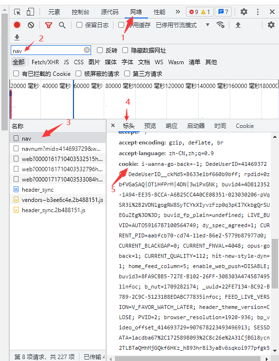
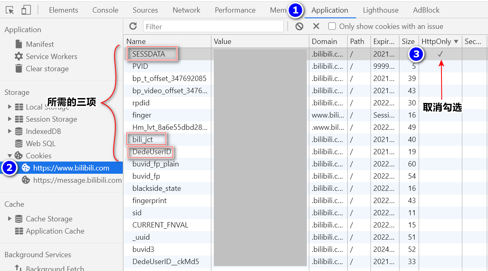
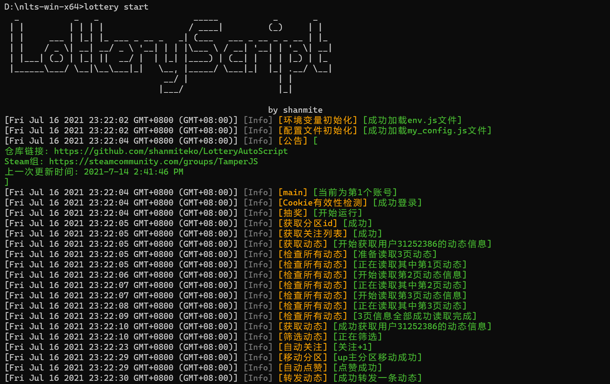

# AutoScript

- [AutoScript](#autoscript)
  - [操作步骤](#操作步骤)
    - [获取COOKIE](#获取cookie)
      - [扫码登陆](#扫码登陆)
      - [手动获取](#手动获取)
    - [本地运行](#本地运行)
      - [可执行文件](#可执行文件)
      - [以源码方式运行](#以源码方式运行)
    - [Docker](#docker)
    - [青龙面板](#青龙面板)
  - [检测中奖](#检测中奖)
    - [检测未读信息, 已读未读信息](#检测未读信息-已读未读信息)
    - [中奖推送](#中奖推送)
  - [设置说明](#设置说明)
    - [评论验证码识别](#评论验证码识别)
    - [其他](#其他)
  - [Awesome](#awesome)

[Github仓库链接](https://github.com/shanmiteko/LotteryAutoScript)

[](https://github.com/shanmiteko/LotteryAutoScript/actions/workflows/pkg.yml)

[](https://github.com/shanmiteko/LotteryAutoScript/actions/workflows/docker.yml)

[](https://github.com/shanmiteko/LotteryAutoScript/actions/workflows/npmp.yml)

[](https://github.com/shanmiteko/LotteryAutoScript/actions/workflows/mirror.yml)

已实现功能:

- 监控用户转发
- 监控话题页面
- 监控专栏合集
- 自动点赞、评论、乱序转发、@好友、带话题、可选随机动态
- 直播预约抽奖
- 检测是否中奖
  - 已读@
  - 已读私信
- 清理动态关注
- 检查更新
- 更多功能设置请参考配置文件

**声明**: 此脚本仅用于学习和测试，作者本人并不对其负责，请于运行测试完成后自行删除，请勿滥用！

---------------------------------

## 操作步骤

**使用前务必阅读此教程和配置文件内注释**

右上角<kbd>★ Star</kbd>

↓↓

### 获取COOKIE

#### 扫码登陆

在`env.js`文件填`COOKIE`的对应位置写入`"DedeUserID=你的UID"`即可使用`lottery login`扫码自动获取Cookie

`COOKIE`中包含`DedeUserID=你的UID`的都会被自动替换

#### 手动获取

第一种
进入[B站主页](https://www.bilibili.com/)点击个人头像进入个人主页获取Cookie用于登录

Chrome浏览器:

进入个人主页后
1. `F12`打开控制台

2. F5刷新

3. 根据图中找到network/网络 搜索nav,点击找到的nav,点标头，下滑，找到COOKIE全部复制


注意！！！！！！！！！！！

注意！！！！！！！！！！！

注意！！！！！！！！！！！

所有网页端获取的COOKIE，每次打开网页端时，都会有概率刷新COOKIE，点击退出账号则会退出当前COOKIE。可以利用Chrome内核的浏览器创建多用户，专门用于获取COOKIE。

注意！！！！！！！！！！！

注意！！！！！！！！！！！

注意！！！！！！！！！！！


第二种
进入[B站主页](https://www.bilibili.com/)获取Cookie用于登录

Chrome浏览器:

1. `F12`打开控制台

2. 进入Application找到Cookies栏中的SESSDATA将HttpOnly选项**取消**勾选  

    (此步骤是为了方便后续采用JS获取Cookies,获取完毕后应再次勾选)



3. 在Console中复制以下代码回车  

    ```js
    /** 自动复制到粘贴板 */
    document
      .cookie
      .split(/\s*;\s*/)
      .map(it => it.split('='))
      .filter(it => ['DedeUserID','bili_jct', 'SESSDATA', 'buvid3'].indexOf(it[0]) > -1)
      .map(it => it.join('='))
      .join('; ')
      .split()
      .forEach(it => copy(it) || console.log(it))
    ```

也可以采用**其他方式获取**所需的Cookie

只需含有 `DedeUserID=...;SESSDATA=...;bili_jct=...;buvid3=...` 即可

buvid3亦可不填 使用随机生成值

(分号分割, 不要换行, 顺序随意)

↓↓

### 本地运行

#### 可执行文件

1. [[下载](https://github.com/shanmiteko/LotteryAutoScript/releases)|[cnpmjs镜像下载](https://github.com.cnpmjs.org/shanmiteko/LotteryAutoScript/releases)|[Fastgit镜像下载](https://hub.fastgit.org/shanmiteko/LotteryAutoScript/releases)]压缩包并解压后

   ```
    ~/nlts-linux-x64
    => tree
    .
    ├── env.js          (便捷设置环境变量和多账号参数)
    ├── lottery         (可执行文件)
    ├── my_config.js    (自定义设置文件) (!使用前必读)
    └── README.md       (说明文件)
   ```

2. 用记事本或其他编辑器修改`env.js`和`my_config.js`文件(右键选择用记事本打开)
3. 在`env.js`中填入`COOKIE`和推送参数
4. 在`my_config.js`中自定义设置
5. 在当前目录下**打开终端**运行可执行文件`lottery`(勿直接点击`lottery`)
  - windows 可直接点击对应的`*.bat`文件

    ```
    用法: lottery [OPTIONS]
    
    OPTIONS:
            start  启动抽奖
            check  中奖检查
            acount 查看帐号信息
            clear  清理动态和关注
            update 检查更新
            login  扫码登录更新CK
            help   帮助信息
    ```

1. 运行截图
    

#### 以源码方式运行

[点击跳转](doc/run_use_sc.md)

----------------------------------------

### Docker

[点击跳转](doc/run_use_docker.md)

----------------------------------------

### 青龙面板

[点击跳转](doc/run_use_ql.md)

----------------------------------------

## 检测中奖

### 检测未读信息, 已读未读信息

判断依据

- 通过`@`信息判断

- 通过私信判断

关键词有限 可能会有**漏掉**的或**误报**

### 中奖推送

> 填写在env.js内

以下是支持的推送方式

|        Name        |                                        归属                                        | 说明                                                                                                                                                                                                                                                                                         |
| :----------------: | :--------------------------------------------------------------------------------: | :------------------------------------------------------------------------------------------------------------------------------------------------------------------------------------------------------------------------------------------------------------------------------------------- |
|      `SCKEY`       |                          微信server酱推送(于2021/4月下线)                          | server酱的微信通知[官方文档](http://sc.ftqq.com/3.version)                                                                                                                                                                                                                                   |
|     `SENDKEY`      |                             微信server酱(Turbo版)推送                              | [获取SENDKEY](https://sct.ftqq.com/sendkey) [选择消息通道](https://sct.ftqq.com/forward)                                                                                                                                                                                                     |
|    `BARK_PUSH`     | [BARK推送](https://apps.apple.com/us/app/bark-customed-notifications/id1403753865) | IOS用户下载BARK这个APP,填写内容是app提供的`设备码`，例如：<https://api.day.app/123> ，那么此处的设备码就是`123`，再不懂看 [这个图](doc/pic/bark.jpg)（注：支持自建填完整链接即可）                                      |
|    `BARK_SOUND`    | [BARK推送](https://apps.apple.com/us/app/bark-customed-notifications/id1403753865) | bark推送声音设置，例如`choo`,具体值请在`bark`-`推送铃声`-`查看所有铃声`                                                                                                                                                                                                                      |
|   `PUSHDEER_URL`   |                  [Pushdeer](https://github.com/easychen/pushdeer)                  | 推送api 默认: <https://api2.pushdeer.com/message/push>                                                                                                                                                                                                                                       |
| `PUSHDEER_PUSHKEY` |                  [Pushdeer](https://github.com/easychen/pushdeer)                  | PushKey                                                                                                                                                                                                                                                                                      |
|   `TG_BOT_TOKEN`   |                                    telegram推送                                    | tg推送(需设备可连接外网),`TG_BOT_TOKEN`和`TG_USER_ID`两者必需,填写自己申请[@BotFather](https://t.me/BotFather)的Token,如`10xxx4:AAFcqxxxxgER5uw` , [具体教程](doc/TG_PUSH.md)                                                                                                                |
|    `TG_USER_ID`    |                                    telegram推送                                    | tg推送(需设备可连接外网),`TG_BOT_TOKEN`和`TG_USER_ID`两者必需,填写[@getuseridbot](https://t.me/getuseridbot)中获取到的纯数字ID, [具体教程](doc/TG_PUSH.md)                                                                                                                                   |
|  `TG_PROXY_HOST`   |                                 Telegram 代理的 IP                                 | 代理类型为 http。例子：http代理 <http://127.0.0.1:1080> 则填写 127.0.0.1                                                                                                                                                                                                                     |
|  `TG_PROXY_PORT`   |                                Telegram 代理的端口                                 | 例子：http代理 <http://127.0.0.1:1080> 则填写 1080                                                                                                                                                                                                                                           |
|   `DD_BOT_TOKEN`   |                                      钉钉推送                                      | 钉钉推送(`DD_BOT_TOKEN`和`DD_BOT_SECRET`两者必需)[官方文档](https://ding-doc.dingtalk.com/doc#/serverapi2/qf2nxq) ,只需`https://oapi.dingtalk.com/robot/send?access_token=XXX` 等于`=`符号后面的XXX即可                                                                                      |
|  `DD_BOT_SECRET`   |                                      钉钉推送                                      | (`DD_BOT_TOKEN`和`DD_BOT_SECRET`两者必需) ,密钥，机器人安全设置页面，加签一栏下面显示的SEC开头的`SECXXXXXXXXXX`等字符 , 注:钉钉机器人安全设置只需勾选`加签`即可，其他选项不要勾选,再不懂看 [这个图](doc/pic/DD_bot.png) |
|  `IGOT_PUSH_KEY`   |                                      iGot推送                                      | iGot聚合推送，支持多方式推送，确保消息可达。 [参考文档](https://wahao.github.io/Bark-MP-helper )                                                                                                                                                                                             |
|     `QQ_SKEY`      |                                酷推(Cool Push)推送                                 | 推送所需的Skey,登录后获取Skey [参考文档](https://cp.xuthus.cc/)                                                                                                                                                                                                                              |
|     `QQ_MODE`      |                                酷推(Cool Push)推送                                 | 推送方式(send或group或者wx，默认send) [参考文档](https://cp.xuthus.cc/)                                                                                                                                                                                                                      |
|     `QYWX_AM`      |                                    企业微信应用                                    | 第一个值是企业id，第二个值是secret，第三个值@all(或者成员id)，第四个值是AgentID (逗号分割) 可查看此[教程](http://note.youdao.com/s/HMiudGkb) [官方文档](https://developer.work.weixin.qq.com/document/path/90236)                                                                            |
|     `QYWX_KEY`     |                                  企业微信Bot推送                                   | 密钥，企业微信推送 webhook 后面的 key [详见官方说明文档](https://work.weixin.qq.com/api/doc/90000/90136/91770)                                                                                                                                                                               |
| `PUSH_PLUS_TOKEN`  |                                    pushplus推送                                    | 微信扫码登录后一对一推送或一对多推送下面的token(您的Token) [官方网站](http://pushplus.hxtrip.com/)                                                                                                                                                                                           |
|  `PUSH_PLUS_USER`  |                                    pushplus推送                                    | 一对多推送的“群组编码”（一对多推送下面->您的群组(如无则新建)->群组编码）注:(1、需订阅者扫描二维码 2、如果您是创建群组所属人，也需点击“查看二维码”扫描绑定，否则不能接受群组消息推送)，只填`PUSH_PLUS_TOKEN`默认为一对一推送                                                                  |
|     `QMSG_KEY`     |                      [Qmsg酱](https://qmsg.zendee.cn)私聊推送                      | [Qmsg注册](https://qmsg.zendee.cn/login.html)                                                                                                                                                                                                                                                |
|     `QMSG_QQ`      |                       私聊消息推送接口，指定需要接收消息的QQ                       | 指定的QQ号必须在你的[管理台](https://qmsg.zendee.cn/me.html)已添加                                                                                                                                                                                                                           |
|    `SMTP_HOST`     |                                      电子邮件                                      | smtp服务器的主机名 如: `smtp.qq.com`                                                                                                                                                                                                                                                         |
|    `SMTP_PORT`     |                                      电子邮件                                      | smtp服务器的端口 如: `465`                                                                                                                                                                                                                                                                   |
|    `SMTP_USER`     |                                      电子邮件                                      | 发送方的电子邮件   如: `xxxxxxxxx@qq.com`                                                                                                                                                                                                                                                    |
|    `SMTP_PASS`     |                                      电子邮件                                      | smtp服务对应的授权码                                                                                                                                                                                                                                                                         |
|   `SMTP_TO_USER`   |                                      电子邮件                                      | 接收方电子邮件                                                                                                                                                                                                                                                                               |
|    `GOTIFY_URL`    |                                     gotify推送                                     | gotify消息推送地址(例如 http://localhost:8008/message)，[官方文档](https://gotify.net/docs/)                                                                                                                                                                                                 |
|  `GOTIFY_APPKEY`   |                                     gotify推送                                     | 一个gotify application的token，[官方文档](https://gotify.net/docs/)                                                                                                                                                                                                                          |

----------------------------------------

## 设置说明

### 评论验证码识别

[点击跳转](doc/chat_captcha_orc.md)

### 其他

详见[env.example.js](./env.example.js)文件内部注释

详见[my_config.example.js](./my_config.example.js)文件内部注释

----------------------------------------

## Awesome
相关项目

- [LotteryAutoScript_Station](https://github.com/spiritLHLS/LotteryAutoScript_Station) - [@spiritLHL](https://github.com/spiritLHLS)
- [sync_lottery](https://github.com/spiritLHLS/sync_lottery) - [@spiritLHL](https://github.com/spiritLHLS)
- [BDSF](https://github.com/spiritLHLS/BDSF) - [@spiritLHL](https://github.com/spiritLHLS)
