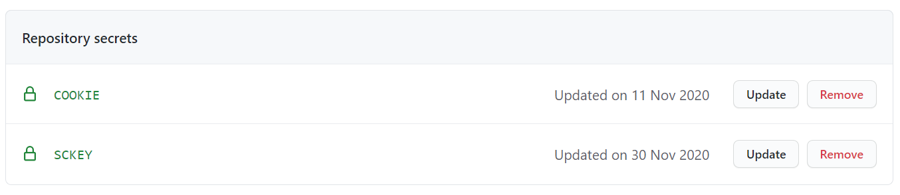
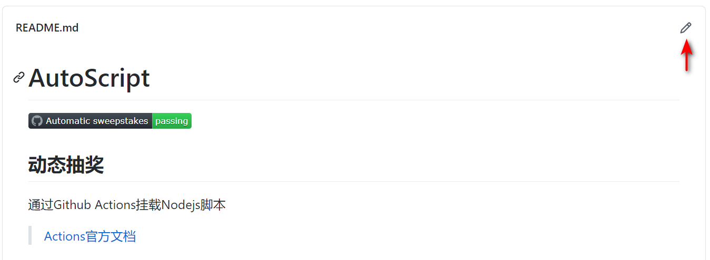
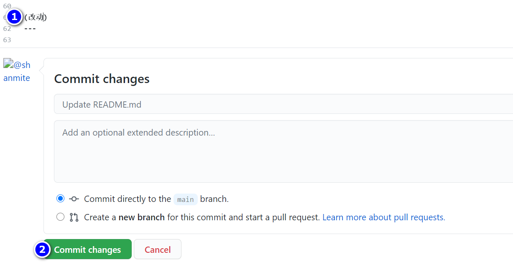

# AutoScript
  

- [AutoScript](#autoscript)
  - [动态抽奖](#动态抽奖)
  - [操作步骤](#操作步骤)
    - [Fork本仓库](#fork本仓库)
    - [填入COOKIE](#填入cookie)
    - [微信推送中奖信息(可选)](#微信推送中奖信息可选)
    - [运行](#运行)
    - [完成!](#完成)
  - [其他细节](#其他细节)

---

## 动态抽奖  
通过Github Actions挂载Nodejs脚本  

  > [Actions官方文档](https://docs.github.com/en/free-pro-team@latest/actions/reference/workflow-syntax-for-github-actions)  

此脚本将在B站专栏草稿中储存信息

---

## 操作步骤  

↓↓  

### Fork本仓库  
  

↓↓  

### 填入COOKIE  
进入[B站主页](https://www.bilibili.com/)获取Cookie用于登录  
Chrome浏览器:  
1. `F12`打开控制台  
2. 进入Application找到Cookies栏中的SESSDATA将HttpOnly选项**取消**勾选  
    (此步骤是为了方便后续采用JS获取Cookies)  
      
3. 在Console中复制以下代码回车  
    ```js
    {
        let bilicookie = '';
        document.cookie.split(/\s*;\s*/).forEach(item=>{
            const _item = item.split('=');
            if (['DedeUserID','bili_jct','SESSDATA'].indexOf(_item[0]) !== -1)
                bilicookie += `${_item[0]}=${_item[1]}; `;
        })
        copy(bilicookie); /* 自动复制到粘贴板 */
        console.log(bilicookie)
    }
    ```
4. 新建一个COOKIE将获取到的`DedeUserID=***;SESSDATA=***;bili_jct=***`填入  
      
      

也可以采用**其他方式获取**所需的Cookie  
只需含有`DedeUserID=...;SESSDATA=...;bili_jct=...`三项即可  
(分号分割，顺序随意)  

↓↓  

### 微信推送中奖信息(可选)  
如果想使用Server酱提供的**微信推送**服务  
> [Server酱是什么?](http://sc.ftqq.com/3.version)  

可在`Repository secrets`中新建一个`SCKEY`并填入相应的值  
  

↓↓  

### 运行  
进入Actions启用工作流  

随便改一下此`README.md`文件并提交(Push触发)  
  
  
**或者**通过手动触发  
  

***以上步骤是为了检测是否配置成功***

至此程序将会每**两小时运行**一次

↓↓  

### 完成!  
效果
  

---

## 其他细节  
- 更新  
    如果出现  
      
    说明此脚本有更新  
    自行搜索`如何同步更新Github上Fork的项目`
- 默认支持5个账号  
    | cookies   | value |
    | --------- | ----- |
    | `COOKIE`  | 值    |
    | `COOKIE2` | 值    |
    | `COOKIE3` | 值    |
    | `COOKIE4` | 值    |
    | `COOKIE5` | 值    |

    也可在`.github/workflows/node.js.yml`中  
    ```yaml
    lottery_*:
    runs-on: ubuntu-latest
    steps:
      - name: 'Checkout codes'
        uses: actions/checkout@v2
      - name: 'Use Node.js'
        uses: actions/setup-node@v1
        with:
          node-version: '12.18.3'
      - name: 'Run in Nodejs'
        shell: bash
        env:
          COOKIE_*: ${{ secrets.COOKIE* }}
          SCKEY: ${{ secrets.SCKEY }}
        run:
          npm start
    ```  
    将以上星号处改为数字并依次复制粘贴  
    此时secret里就可以添加更多的Cookie(简单的找规律问题)  

- 部分设置说明  
    - 定时运行(`UTC`时间)  
        `.github/workflows/node.js.yml`  
        ```yaml
        schedule:
          - cron: '0 */2 * * *'
        ```  
        [填写格式](https://crontab.guru/)  
    - 模式选择  
        `lib/config.js`
        ```javascript
        /**
         * 默认设置
         */
        let config = {
            model: '11',/* both */
            chatmodel: '11',/* both */
        }
        ```  
        [具体含义](https://github.com/shanmite/LotteryAutoScript/issues/2)  

---

