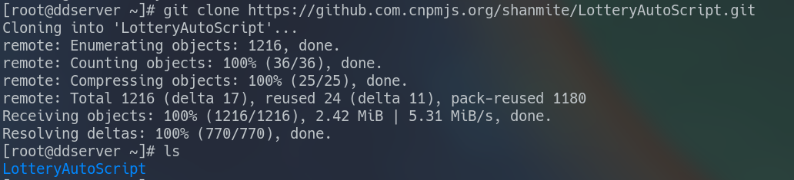
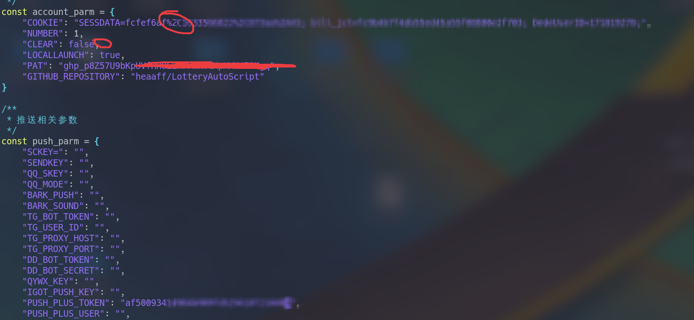
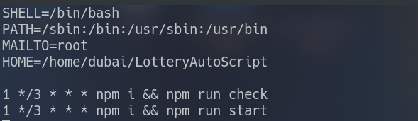
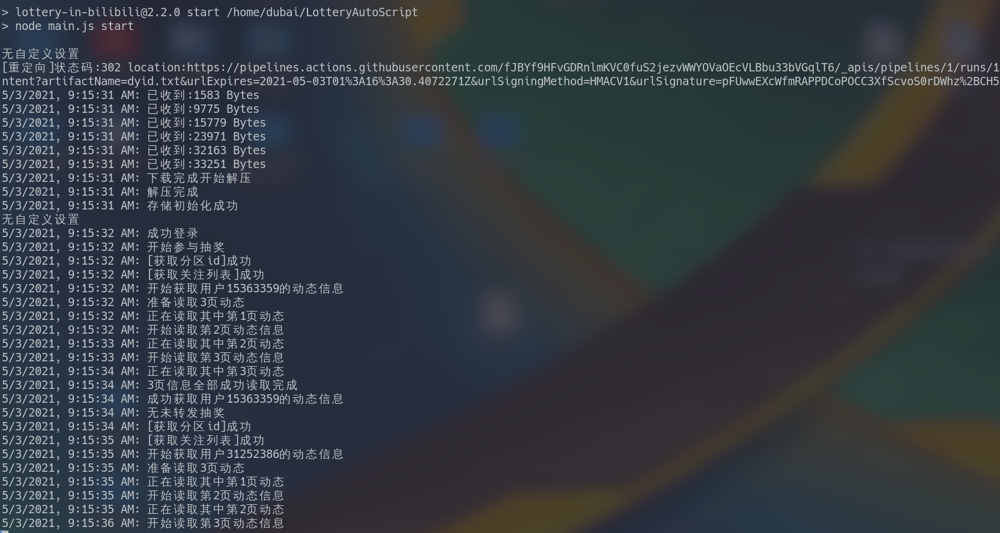

1.通过ssh连接服务器  

1.1安装Node.js  

根据自己服务器的版本使用对应的命令安装  

> eg.[Ubuntu如何安装nodejs](https://zhuanlan.zhihu.com/p/140961618)


2.下载脚本到本地  

```sh
git clone https://github.com/shanmite/LotteryAutoScript.git
```

  

**注意**: github访问下载速度可能很慢, 如果卡住了可以通过Github镜像网站下载  

```sh
git clone https://github.com.cnpmjs.org/shanmite/LotteryAutoScript.git
```


3.`cd`命令进入目录,将其中的`env.example.js`文件重命名为`env.js`  

```sh
mv env.example.js env.js
```


4.编辑env.js  

```sh
vim env.js
# 按i进入编辑模式
# 改完了依次输入 Esc => : => wq 即可保存退出
# 此处可查阅Vim的使用手册
```

  

说明: `"CLEAR"`项设置为`true`, 才可以开启自动清理动态功能  

`"PAT"`和`"GITHUB_REPOSITORY"`不填也行  


5.设置定时工作  
> [linux系统定时运行](https://zhuanlan.zhihu.com/p/58719487)  

输入:

```sh
crontab -e
```

  

`SHELL` 和 `PATH`照着填

`MAILTO`不填也行

注意`HOME`后面跟脚本所在的目录, 这样才能到那个目录下去执行命令


6.手动运行一波

`cd` 进入文件目录

`npm i`

`npm run start`

看看有没有效果




7.如果本地的脚本需要更新

进入脚本目录下

```sh
git pull
```