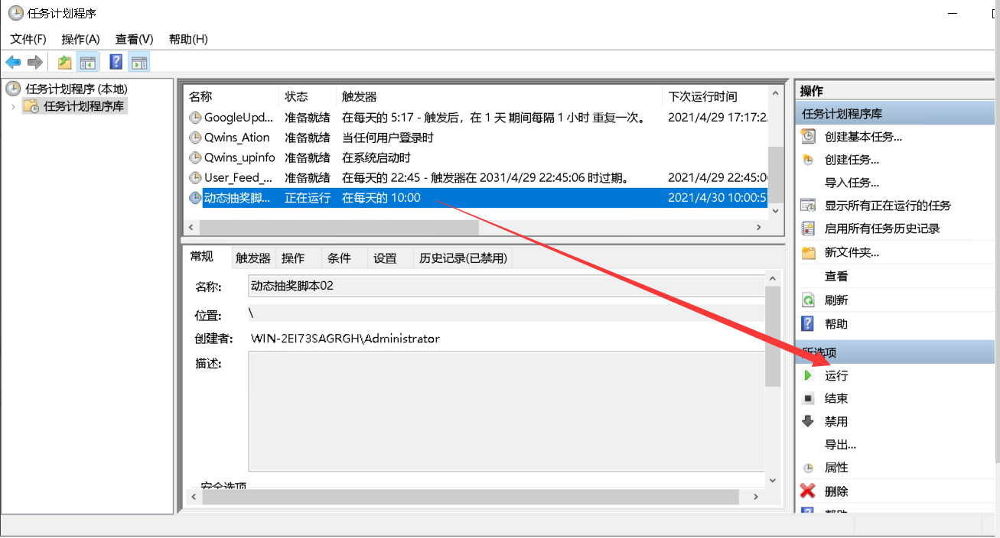

## win系统定时计划运行

本地定时运行(在Windows系统的操作)

1.右键我的电脑打开控制面板，或在win10搜索框里搜索控制面板打开          

2.在`控制面板`右上角的搜索框里搜索`计划任务`点击打开         

3.在`任务计划程序`中选择`任务计划程序库`         

4.在右边的操作框中选择`创建任务`        

5.在`常规`页面中的名称框中写入计划名称后，在`安全选项`里选择`不管用户是否登陆都要运行`，`使用最高权限运行`         

6.在`触发器`页面中规划时间，点击`新建`，选择设置`每天`和具体开始时间以及间隔时间，高级设置直接看情况选择          

7.在`操作`页面中点击`新建`，选择操作为`启动程序`，在设置里点击浏览找到`start.bat`文件并选择，在`起始于(可选)(T)：`中的空白框里输入`start.bat`文件的目录地址，也就是`程序或脚本(P)：`里`start.bat`的前面那一串目录地址，最后是以`\`结尾的 ，填好东西后按下面`确认`              

             

8.在`条件`页面中选择`网络`，设定启动条件为任何连接            

9.在`设置`页面中选择如图示选项，或者不修改默认设置           

            

10.最后按`确定`          

11.此时它会弹框要求输入用户密码，一般是你的开机密码确认身份，这个对于服务器来说就是远程桌面开启的那个密码         

最后你可以在任务列表中选择已有的任务，右边的操作框中选择`运行`点击，启动计划的任务，如下图所示

具体看任务是否正常执行，你可以看看自己的账号动态的最新转发，运行成功每几分钟自动转发抽奖动态
